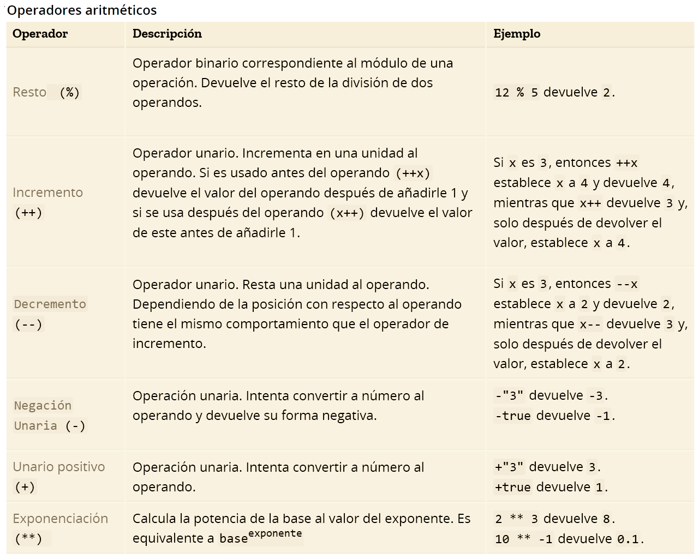
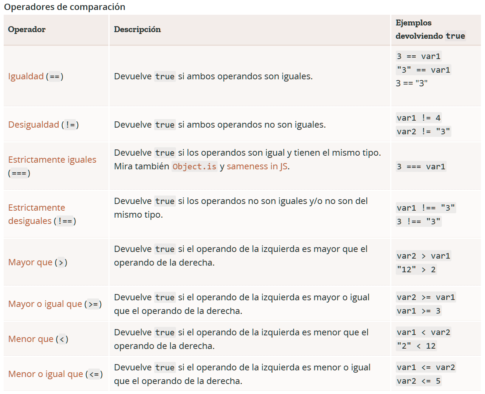
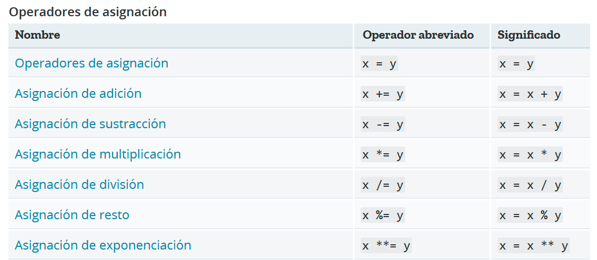

# Conociendo JavaScript

## Indice

- [Introducción](#introducción)
- [Concepto](#concepto)
- [Variables](#variables)
- [Operadores](#operadores)
- [Arrays](#arrays)
- [Bucles](#bucles)
- [Funciones](#funciones)
- [POO](#poo-programacion-orientada-a-objetos)

## Introducción

Bienvenido a "Conociendo JavaScript", este es un repositorio creado por mi enfocado en explicar no solo la logica, si no tambien de manera clara y concisa los distintos aspectos que poseé JavaScript y como emplearlos de la mejor manera. Refuerza tu logica con los distintos ejemplos y ejercicios practicos que te voy a ofrecer aquí, y recuerda, ir practicando mientras vas aprendiendo sobre cada tema para afianzar de mejor manera los conceptos.

## Concepto

### ¿Que es JavaScript?

JavaScript es un lenguaje de programación de alto nivel principalmente usado para el diseño web agregandole dinamismo a la interaccion entre el usuario y una pagina web.

Es usado tambien en distintas tecnologias Frontend como Angular, React o Vue.js y como tecnologias Backend tenemos a NodeJS.

### JavaScript cuenta con las siguientes cualidades:

- **Lenguaje interpretado** : no necesita ser compilado para poder ejecutarse, si no que el propio navegador lo interpreta.

- **Lenguaje orientado a objetos** : abarca muchas de las funcionalidades que tienen los lenguajes orientado a objetos ( uso de clases, herencia, polimorfismo...).

- **Lenguaje imperativo** : el codigo se ejecutará linea por linea hasta llegar al final o se detenga por un error en el camino.

- **Lenguaje Case Sensitive** : es sensible al uso de mayusculas o minusculas en el codigo.

- **Lenguaje basado en prototipos**

- **Lenguaje tipado debil**

- **Configurado en ECMAScript** : es la version con la que trabajaremos con el codigo y las funcionalidades de esta version.

## Variables

### ¿Que es una variable?

Una variable como su nombre lo dice, se refiere a un tipo de dato donde su valor o contenido puede variar con el tiempo, es decir, no tiene un valor fijo y esta sujeto a cambios.

### Tipos de variables

JavaScript consta con distintas variables que podemos usar en nuestro codigo que son:

- `String`: son variables que contienen cadenas de texto.

- `Number`: variables que contienen numeros de cualquier tipo, como decimales o enteros.

- `Boolean`: variables cuyo valor varia entre True (verdadero) o False (falso).

### ¿Como se declara una variable en JavaScript?

Para declarar una variable en JavaScript primero tenemos que tener en cuenta varios conceptos como el "**Scope**" que viene siendo lo que es el alcance que una variable va a tener en todo nuestro codigo y que ese alcance varia segun el metodo como declaramos nuestra variable.

contamos con tres metodos principales para declarar una variable que son:

- `Var` : antes de ECMAcript 6 se usaba mucho el metodo var para declarar variables, en la actualidad no es muy usado ya declara variables globales, es decir, se pueden usar en todo el codigo.

- `Let` : la forma mas usada y mas recomendable para declarar variables, aunque su alcance sea de tipo bloque no importará si sabemos usarla como se debe, ademas que hace nuestro codigo mas intuitivo.

- `Const` : se declara una variable que es constante, es decir, su valor no se puede cambiar una vez lo hayamos definido, y tiene un alcance de bloque.

## Operadores

JavaScript tiene operadores binarios y unarios, y un operador ternario especial, el operador condicional. Un operador binario necesita dos operandos, uno antes del operador y otro después de este. `Por ejemplo 4+7`

Un operador unario requiere solamente un operando antes o después del operador. `Por ejemplo x++`

### Operadores aritméticos
---
Los operadores aritmeticos son los que nos permiten hacer calculos simples como resta o multiplicacion.



### Operadores de comparación
---
Son aquellos que nos permiten comparar dos variables entre si y lanzar una respuesta según el resultado de esa comparación.



### Operadores Asignación
---
Los operadores de asignación son aquellos que usamos para agregarle o cambiarle el valor a una variable ya existente.



### Operadores Lógicos
---
Son aquellos que retornan un valor Booleano apartir de que se cumpla (o no) una condición.


## Condicionales

Los condicionales son estructuras que permiten tomar decisiones en el codigo, ejecutando un bloque si esta se cumple o no.

En JavaScript contamos con tres principales formas de usar condicionales que son:

- `if` : ejecuta un bloque de codigo si la condicion es verdadera.
```javascript
let numero = 5;
if (numero > 0){
    console.log("tu numero es mayor a 0");
};
```
- `else if` : ejecuta un bloque de codigo si la condicion anterior no se cumple.
```javascript
let numero = -5
if (numero > 0){
    console.log("tu numero es mayor a 0");
}else if (numero < 0){
    console.log("tu numero es menor a 0");
};
```
- `else` : ejecuta un bloque de codigo solo si ninguna condicion se cumple, usado mas que nada para manejar casos mas alla de nuestro alcance.

```javascript
let numero = "hola";
if (numero >= 0){
    console.log("tu numero es positivo");
}else if (numero < 0){
    console.log("tu numero es negativo");
}else{
    console.log("el dato ingresado no es un numero");
};
```
### Ejercicio de practica

Para acceder al ejercicio de practica dirigase a la carpeta [Ejercicio-condicionales](./Ejercicio-condicionales/main.js)

## ARRAYS

### ¿Que es un "array"?

Un "array" o arreglo es una estructura de datos que almacena una colección de elementos, generalmente del mismo tipo, cuyo elemento se puede acceder mediante el indice o posicion que este ocupa dentro del array.

### ¿Como se declara un array?

Tenemos distintas formas para declarar nuestro array, la mas utilizada y recomendada es por medio de la declaracion Let, como si estuvieramos declarando una variable, solo que los elementos que contendra nuestra array deben estar dentro de corchetes ( [ ] ).

```javascript
let array = ["elemento1", "elemento2", "elemento3"];
```

Cada elemento ocupara una posicion en nuestra array que será identificada por un indice, comenzando por 0 como inicio de nuestra array.

Para acceder a los elementos se haria de la siguiente manera:

```javascript
let frutas = ["manzana","pera","mango"];
console.log(frutas[1]);//muestra en consola "pera"
```

En el debido caso que no queramos acceder mediante indices podemos simular un **"array asociativo"** donde podremos acceder a los elementos usando una clave.

En JavaScript podemos simular un array asociativo con el uso de objetos de la siguiente forma:

```javascript
let camioneta = {
    marca: "ford",
    traccion: "4x4",
    espacioEnCabina: "doble"
};
console.log(camioneta["marca"]); //muestra en consola el valor de la clave "marca" que seria "ford"
```
### Ejercicio de practica

Para acceder al ejercicio de practica dirigase a la carpeta [Ejercicio-arrays](./Ejercicio-arrays/main.js)

## Bucles

Los bucles son aquellos ciclos que ejecutaran un bloque de codigo simultaneamente hasta que nosotros se lo indiquemos por medio de una condicion (o simplemente se ejecuten infinitamente).

Dentro de estos encontraremos los siguientes:

- `while`: Ejecuta un bloque de codigo si la condicion es verdadera, cabe aclarar que tenemos que darle un alto al bucle para que no se ejecute infinitamente y de errores a futuro.
    ```javascript
    let ciclo = 10;
    //imprime en consola un conteo del 10 al 0
    while (ciclo >= 0){
        console.log(ciclo);
        ciclo--;
    };
    ```

- `for`: Ejecuta un bloque hasta que una condición especificada se evalúe como falsa, la diferencia con el bucle **while** radica que el bucle **for** se basa en una estructura ya definida donde nosotros especificamos, una variable de inicializacion, la condicion, y una expresion por iteracion.
    ```javascript
    for ([inicializacion]; [condicion]; [expresionPorIteracion]){
        codigo a ejecutar
    }
    ```
    *ejemplo practico:*
    ```javascript
    //imprimirá en consola un conteo del 10 al 0
    for (let i = 10; i > 0; i--){
        console.log(i);
    };
    ```

- `for in / for of`: Ambos son principalmente usados para iterar sobre los elementos de un objeto como arrays, strings o maps, la diferencia es que el `for in` itera sobre el indice de los elementos dentro de un objeto mientras que `for of` trabaja con el valor de esa misma posicion.

    *for in*
    ```javascript
    let animales = ["perro", "gato", "mapache"];
    for (animal in animales){
        console.log(animal);//devolvera el indice
    };
    ```
    *for of*
    ```javascript
    let animales = ["perro", "gato", "mapache"];
    for (animal of animales){
        console.log(animal);//devolvera el valor
    };
    ```
### Sentencia `continue`

Una sentencia es una instruccion que se le da a un proceso para alterar su flujo en la ejecucion, en los bucles podemos usar sentencias para alterar el comportamiento en los ciclos de nuestro bucle, una de las sentencias mas utilizadas es `continue`.

Esta instruccion se encarga de que el bucle, llegado hasta cierto punto se reinicie, ignorando lo que le sigue y volviendo a empezar, como si le dijeran a un corredor a mitad de la carrera "**ve al punto de partida, pero devolviendo tus pasos**", esto se usa mas que nada cuando queremos ignorar porciones de codigo de nuestro bucle que no hace falta ejecutar si se cumple un proposito y asi volver a empezar un bucle, usado mas que nada en menus.

*ejemplo practico*
```javascript
let i = 10;
//conteo del 10 al 0 omitiendo el 5
while (i >= 0){
    if (i == 5){
        i--;
        continue;
    };
    console.log(i);
    i--;
};
```
### Sentencia `break`

Se emplea de la misma manera con la que usamos `continue` solo que a diferencia de omitir una porcion de codigo no requerida, este lo que hace es romper ese bucle, es decir, detenerlo, usado cuando ya no queremos que el bucle siga corriendo y se detenga en cierto punto.

*ejemplo practico*
```javascript
let coders = ["eduardo", "adrian", "maria", "santiago"];

//recorre los indices del array "estudiantes"
for (coder in coders){
    if (coder == 2){
        break; //rompe la iteracion del bucle al llegar a la posicion 2
    };
    console.log(coders[coder]);//accede al valor del elemento en esa posicion
};
```
### Ejercicio de practica

Para acceder al ejercicio de practica dirigase a la carpeta [Ejercicio-Bucles](./Ejercicio-Bucles/main.js)

## Funciones

### ¿Que es una función?

Una funcióm en JavaScript y en el ambito de la programación en general, es un bloque de codigo reutizilable cuyo proposito principal es que se pueda usar varias veces dentro de nuestro codigo sin necesidad de saturarlo.

Las funciones esperan de parte nuestra una serie de parametros que nosotros definimos (opcional) para luego retornarnos un valor según las instrucciones que nosotros definamos dentro de ella.

### ¿Como se declara una función?

Para declarar una funcion primero tenemos que definirle un nombre unico a nuestra funcion, definir los parametros que recibirá (opcional), el bloque que va a ejecutar internamente, y el valor que nos va a retornar una vez finalizada la funcion. Contamos con tres principales formas para declarar una funcion, cada una muy util segun las circunstancias que lo ameriten.

**1. Declaración de función (Function Declaration):**
```javascript
//declaracion
function saludar (nombre){
    let mensaje = ("hola, tu nombre es: " + nombre);
    return mensaje;
};
//llamada de la funcion dentro de un console.log para imprimirlo en consola
console.log(saludar("alex"));
```
Esta es la manera mas basica para declarar una funcion, definimos su nombre, valores de entrada(opcional), el codigo con el que trabajará internamente y el valor que nos retornará, no es muy utilizada en la actualidad pero si es facil de entender.

**2. Expresión de función (Function Expression):**
```javascript
//se expresa la funcion asignandosela a una variable
const saludar = function(nombre){
    let mensaje = ("hola, tu nombre es: " + nombre);
    return mensaje;
};

console.log(saludar("edinson"));
```
Esta alternativa funciona igual que una declaracion de función, solo que esta se le asigna a una variable creando una expresión.

**3. Funciones flecha (Arrow Functions):**

*estructura*
```javascript
const nombreDeTuFuncion = (parametros) => {
    codigo a realizar;
    return valor a regresar;
};
```
Una de las alternativas mas recomendables y usadas a la hora de trabajar con funciones, ya que esta te proporciona algunas ventajas que las otras no pueden, por ejemplo;

 cuando tengas una funcion con una sola expresión a realizar, no hara falta abrir con llaves e incluso si la funcion solo requiere un parametro, no hará falta cerrarlo en parentesis, si no que podras escribir en esa misma linea el valor que retornará.
*ejemplo*
```javascript
const saludar = nombre => "hola, tu nombre es: " + nombre;

console.log(saludar("antonio"));
```

**ejemplo practico**
```javascript
const mensajeInicial = function(nombre, instruccion){
    let mensaje;
    if (instruccion == "saludar"){
        mensaje = ("Bienvenido " + nombre);
        return mensaje; //valor de la variable que queremos retornar
    }else if (instruccion == "despedir"){
        mensaje = ("Ten un buen dia " + nombre);
        return mensaje;
    };
};
//variables con las que trabajara nuestra funcion
let persona = "adrian";
let instruccion = "despedir";

console.log(mensajeInicial(persona, instruccion));//retorna "ten un buen dia adrian"
```
### Ejercicio de practica

Para acceder al ejercicio de practica dirigase a la carpeta [Ejercicio-Funciones](./Ejercicio-Funciones/main.js)

## POO (Programacion orientada a objetos)

La Programación Orientada a Objetos es un paradigma de programación que organiza el diseño de software en torno a objetos, es decir, permite estructurar nuestro codigo de mejor forma haciendo uso de objetos que nosotros creamos por una clase y les definimos una serie de propiedades o comportamientos (metodos, atributos, herencia...).

### Conceptos relevantes

- **Clase** : Será el contenedor a donde van nuestros objetos una vez creados, y posteriormente identificados por esa clase.

- **Objeto** : Como su nombre lo dice, es el objeto que crearemos y posteriormente agregarle propiedades u comportamientos.

- **Atributo** : Es una caracteristica que tendrá nuestro objeto una vez creado, ejemplo; si un objeto tiene tal edad, es de tal color, etc..

- **Metodo** : Es una funcion que define un comportamiento o accion que se realizará en relación a nuestro objeto.

- **Polimorfismo** : Es la capacidad que tiene nuestro objeto de comportarse diferente según las propiedades que tenga.

- **Encapsulacion** : Se trata de ocultar los datos de un objeto al usuario dificultandole el acceso.

### ¿Como creamos un objeto?

Para crear nuestro primer objeto tenemos que definir una clase donde crearemos nuestro objeto y asignarle sus propiedades.

```javascript
//instancia una clase llamada animal
class Animal{
};
```
Dentro de la clase le vamos a indicar como se va a construir nuestro objeto mediante la funcion `constructor` que lo que hace es crear un objeto y sus propiedades segun los parametros recibidos, es decir, le indicaremos a la funcion constructor como y que se requiere para la creacion de nuestro objeto.

```javascript
//le indicamos a la funcion constructor, con que se va a construir nuestro objeto.
class Animal{
    constructor(raza, color, edad, locomocion){
    };
};
```
Posteriormente se agregan las propiedades que va a tener nuestro objeto segun la informacion que reciba el constructor, para agregarle las propiedad que queramos haremos el uso del `this` que se refiere nuestro objeto y la propiedad que tendrá.

```javascript
//el valor de this.raza será la informacion recibida por parte de los parametros del constructor
class Animal{
    constructor(especie, color, edad, locomocion){
        this.especie = especie;
    };
};
```
Si el constructor recibe "perro" en el parametro "especie", usaremos esa informacion para crear una propiedad llamada especie y que tenga como valor la informacion recibida por parte del parametro.

Una vez finalizada la estructura que tendra el constructor para crear nuestro objeto declararemos una variable que será el objeto que vamos a crear para luego agregarla a nuestra clase con el comando `new`.

```javascript
//creacion de la clase animal
class Animal{
    constructor(especie, color, edad, locomocion){
    this.objectEspecie = especie;
    this.objectColor = color;
    this.objectEdad = edad;
    this.objectLocomocion = locomocion;
    };
};

//declaracion de nuestro objeto y adicion en la clase animal pasandole los parametros que requiere el constructor para crear nuestro objeto
const perro = new Animal("perro", "blanco", 8, "bipedo");
```
Una vez ya creado nuestro objeto con sus propiedades y ya asignado a una clase, accederemos a los atributos de este escribiendo el nombre del objeto y la propiedad que deseamos mostrar, Ej;
```javascript
console.log(perro.objectEspecie);
//mostrará en consola el valor del atributo especie de nuestro objeto "perro"
```
Recordemos que tambien podemos agregarle metodos a nuestro objeto, es decir, son funciones cuyo objetivo es asignarle una acción o comportamiento a nuestro objeto, esto lo logramos agregandolo como funcion dentro de la clase, fuera del `constructor`.

```javascript
class Figura{
    constructor(lados, color, nombre){
        this.objectNombre = nombre;
        this.objectLados = lados;
        this.objectColor = color;
    };
    //acción que mostrará la informacion del objeto
    objectInfo(){
        console.log(`Soy un ${this.objectNombre}, tengo ${this.objectLados} lados, y soy de color ${this.objectColor}`); 
    };
};
//declaracion de nuestras figuras y sus propiedades como un objeto en la clase "Figura"
const triangulo = new Figura(3, "rojo", "triangulo");
const cuadrado = new Figura(4, "azul", "cuadrado");

//Llama al metodo de nuestro objeto que se encarga de mostrar su información
triangulo.objectInfo();
cuadrado.objectInfo();
```
### Puntos clave a tener en cuenta
- Se recomienda declarar los objetos como constantes.

- La funcion `constructor` no es obligatoria si nuestra clase no requiere recibir parametros para las propiedades de nuestros objetos.

- Para concatenar (unir cadenas de texto) variables a una cadena de texto de la mejor manera, se recomienda el uso de backtiks (comillas invertidas) donde contendrá nuestra cadena de texto, donde agregaremos nuestras variables haciendo uso de la sintaxis "`${variable}`".

- Es recomendable que nuestras clases tengan como inicio su primer caracter en mayusculas, esto para evitar posibles confusiones entre variables u objetos.

- Los metodos creados para una clase **NO** pueden ser funciones flechas ni funciones de expresión.
### Ejercicio de practica

Para acceder al ejercicio de practica dirigase a la carpeta [Ejercicio-POO](./Ejercicio-POO/main.js)