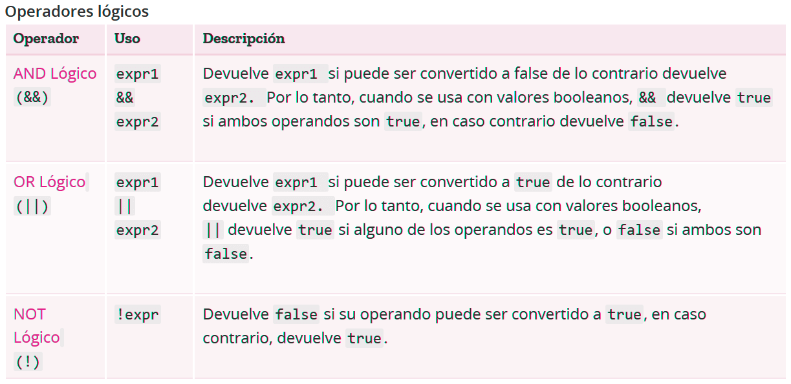

<div align="center">

# Junior Travel - Conociendo JavaScript


### My Social Medias 📲

<p align="center">
    <a href="https://www.linkedin.com/in/davin-coder/" target="_blank">
        </a>&nbsp;&nbsp;
    <a href="https://www.instagram.com/davin_coder/" target="_blank">
        </a>&nbsp;&nbsp;
    <a href="https://github.com/Davin-coder" target="_blank">
        </a>&nbsp;&nbsp;
</p>

</div>

## Introducción

Bienvenido a "Conociendo JavaScript", este es un repositorio creado por mi enfocado en explicar no solo la logica, si no tambien de manera clara y concisa los distintos aspectos que poseé JavaScript y como emplearlos de la mejor manera. Refuerza tu logica con los distintos ejemplos y ejercicios practicos que te voy a ofrecer aquí, y recuerda, ir practicando mientras vas aprendiendo sobre cada tema para afianzar de mejor manera los conceptos.

Recuerda tener a disposición un editor de texto como Visual Studio Code, para el trabajo de los diferentes temas vistos aquí y poder acceder de mejor manera a los recursos utilizados junto a sus ejercicios de practica.

## Indice de Temas

- [Concepto](#concepto)
- [Variables](#variables-en-javascript)
- [Operadores](#operadores-en-javascript)
- [Condicionales](#condicionales-en-javascript)
- [Arrays](#arrays)
- [Bucles](#bucles-en-javascript)
- [Funciones](#funciones-en-javascript)
- [Metodos Nativos](#metodos-en-javascript)
- [POO (programacion orientada a objetos)](#poo-programacion-orientada-a-objetos)
- [Manejo de datos con POO](#manejo-de-datos-con-poo)

## Concepto

### ¿Que es JavaScript?

JavaScript es un lenguaje de programación de alto nivel principalmente usado para el diseño web agregandole dinamismo a la interaccion entre el usuario y una pagina web.

Es usado tambien en distintas tecnologias Frontend como Angular, React o Vue.js y como tecnologias Backend tenemos a NodeJS.

### JavaScript cuenta con las siguientes cualidades:

- **Lenguaje interpretado** : no necesita ser compilado para poder ejecutarse, si no que el propio navegador lo interpreta.

- **Lenguaje orientado a objetos** : abarca muchas de las funcionalidades que tienen los lenguajes orientado a objetos ( uso de clases, herencia, polimorfismo...).

- **Lenguaje imperativo**: El codigo se ejecutará linea por linea hasta llegar al final o se detenga por un error en el camino.

- **Lenguaje Case Sensitive**: Es sensible al uso de mayusculas o minusculas en el codigo.

- **Lenguaje tipado debil**: Puede convertir un tipo de dato a otro de forma automática.

- **Configurado en ECMAScript**: Es la version con la que trabajaremos con el codigo y las funcionalidades de esta version.

## Variables en JavaScript

### ¿Que es una variable?

Una variable como su nombre lo dice, se refiere a un tipo de dato donde su valor o contenido puede variar con el tiempo, es decir, no tiene un valor fijo y esta sujeto a cambios.

### Tipos de variables

JavaScript consta con distintas variables que podemos usar en nuestro codigo que son:

- `String`: son variables que contienen cadenas de texto.

- `Number`: variables que contienen numeros de cualquier tipo, como decimales o enteros.

- `Boolean`: variables cuyo valor varia entre True (verdadero) o False (falso).

### ¿Como se declara una variable en JavaScript?

Para declarar una variable en JavaScript primero tenemos que tener en cuenta varios conceptos como el "**Scope**" que viene siendo lo que es el alcance que una variable va a tener en todo nuestro codigo y que ese alcance varia segun el metodo como declaramos nuestra variable.

contamos con tres metodos principales para declarar una variable que son:

- `Var` : antes de ECMAcript 6 se usaba mucho el metodo var para declarar variables, en la actualidad no es muy usado ya declara variables globales, es decir, se pueden usar en todo el codigo.

- `Let` : la forma mas usada y mas recomendable para declarar variables, aunque su alcance sea de tipo bloque no importará si sabemos usarla como se debe, ademas que hace nuestro codigo mas intuitivo.

- `Const` : se declara una variable que es constante, es decir, su valor no se puede cambiar una vez lo hayamos definido, y tiene un alcance de bloque.

## Operadores en JavaScript

JavaScript tiene operadores binarios y unarios, y un operador ternario especial, el operador condicional. Un operador binario necesita dos operandos, uno antes del operador y otro después de este. `Por ejemplo 4+7`

Un operador unario requiere solamente un operando antes o después del operador. `Por ejemplo x++`

### Operadores aritméticos
---
Los operadores aritmeticos son los que nos permiten hacer calculos simples como resta o multiplicacion.


### Operadores de comparación
---
Son aquellos que nos permiten comparar dos variables entre si y lanzar una respuesta según el resultado de esa comparación.


### Operadores Asignación
---
Los operadores de asignación son aquellos que usamos para agregarle o cambiarle el valor a una variable ya existente.


### Operadores Lógicos
---
Son aquellos que retornan un valor Booleano apartir de que se cumpla (o no) una condición.



## Condicionales en JavaScript

Los condicionales son estructuras que permiten tomar decisiones en el codigo, ejecutando un bloque si esta se cumple o no.

En JavaScript contamos con tres principales formas de usar condicionales que son:

- `if` : ejecuta un bloque de codigo si la condicion es verdadera.
```javascript
let numero = 5;
if (numero > 0){
    console.log("tu numero es mayor a 0");
};
```
- `else if` : ejecuta un bloque de codigo si la condicion anterior no se cumple.
```javascript
let numero = -5
if (numero > 0){
    console.log("tu numero es mayor a 0");
}else if (numero < 0){
    console.log("tu numero es menor a 0");
};
```
- `else` : ejecuta un bloque de codigo solo si ninguna condicion se cumple, usado mas que nada para manejar casos mas alla de nuestro alcance.

```javascript
let numero = "hola";
if (numero >= 0){
    console.log("tu numero es positivo");
}else if (numero < 0){
    console.log("tu numero es negativo");
}else{
    console.log("el dato ingresado no es un numero");
};
```
### Ejercicio de practica

Para acceder al ejercicio de practica dirigase a la carpeta [Ejercicio-condicionales](./Ejercicio-condicionales/main.js)

## ARRAYS

### ¿Que es un "array"?

Un "array" o arreglo es una estructura de datos que almacena una colección de elementos, generalmente del mismo tipo, cuyo elemento se puede acceder mediante el indice o posicion que este ocupa dentro del array.

### ¿Como se declara un array?

Tenemos distintas formas para declarar nuestro array, la mas utilizada y recomendada es por medio de la declaracion Let, como si estuvieramos declarando una variable, solo que los elementos que contendra nuestra array deben estar dentro de corchetes ( [ ] ).

```javascript
let array = ["elemento1", "elemento2", "elemento3"];
```

Cada elemento ocupara una posicion en nuestra array que será identificada por un indice, comenzando por 0 como inicio de nuestra array.

Para acceder a los elementos se haria de la siguiente manera:

```javascript
let frutas = ["manzana","pera","mango"];
console.log(frutas[1]);//muestra en consola "pera"
```

En el debido caso que no queramos acceder mediante indices podemos simular un **"array asociativo"** donde podremos acceder a los elementos usando una clave.

En JavaScript podemos simular un array asociativo con el uso de objetos de la siguiente forma:

```javascript
let camioneta = {
    marca: "ford",
    traccion: "4x4",
    espacioEnCabina: "doble"
};
console.log(camioneta["marca"]); //muestra en consola el valor de la clave "marca" que seria "ford"
```
### Ejercicio de practica

Para acceder al ejercicio de practica dirigase a la carpeta [Ejercicio-arrays](./Ejercicio-arrays/main.js)

## Bucles en JavaScript

Los bucles son aquellos ciclos que ejecutaran un bloque de codigo simultaneamente hasta que nosotros se lo indiquemos por medio de una condicion (o simplemente se ejecuten infinitamente).

Dentro de estos encontraremos los siguientes:

- `while`: Ejecuta un bloque de codigo si la condicion es verdadera, cabe aclarar que tenemos que darle un alto al bucle para que no se ejecute infinitamente y de errores a futuro.
    ```javascript
    let ciclo = 10;
    //imprime en consola un conteo del 10 al 0
    while (ciclo >= 0){
        console.log(ciclo);
        ciclo--;
    };
    ```

- `for`: Ejecuta un bloque hasta que una condición especificada se evalúe como falsa, la diferencia con el bucle **while** radica que el bucle **for** se basa en una estructura ya definida donde nosotros especificamos, una variable de inicializacion, la condicion, y una expresion por iteracion.
    ```javascript
    for ([inicializacion]; [condicion]; [expresionPorIteracion]){
        codigo a ejecutar
    }
    ```
    *ejemplo practico:*
    ```javascript
    //imprimirá en consola un conteo del 10 al 0
    for (let i = 10; i > 0; i--){
        console.log(i);
    };
    ```

- `for in / for of`: Ambos son principalmente usados para iterar sobre los elementos de un objeto como arrays, strings o maps, la diferencia es que el `for in` itera sobre el indice de los elementos dentro de un objeto mientras que `for of` trabaja con el valor de esa misma posicion.

    *for in*
    ```javascript
    let animales = ["perro", "gato", "mapache"];
    for (animal in animales){
        console.log(animal);//devolvera el indice
    };
    ```
    *for of*
    ```javascript
    let animales = ["perro", "gato", "mapache"];
    for (animal of animales){
        console.log(animal);//devolvera el valor
    };
    ```
### Sentencia `continue`

Una sentencia es una instruccion que se le da a un proceso para alterar su flujo en la ejecucion, en los bucles podemos usar sentencias para alterar el comportamiento en los ciclos de nuestro bucle, una de las sentencias mas utilizadas es `continue`.

Esta instruccion se encarga de que el bucle, llegado hasta cierto punto se reinicie, ignorando lo que le sigue y volviendo a empezar, como si le dijeran a un corredor a mitad de la carrera "**ve al punto de partida, pero devolviendo tus pasos**", esto se usa mas que nada cuando queremos ignorar porciones de codigo de nuestro bucle que no hace falta ejecutar si se cumple un proposito y asi volver a empezar un bucle, usado mas que nada en menus.

*ejemplo practico*
```javascript
let i = 10;
//conteo del 10 al 0 omitiendo el 5
while (i >= 0){
    if (i == 5){
        i--;
        continue;
    };
    console.log(i);
    i--;
};
```
### Sentencia `break`

Se emplea de la misma manera con la que usamos `continue` solo que a diferencia de omitir una porcion de codigo no requerida, este lo que hace es romper ese bucle, es decir, detenerlo, usado cuando ya no queremos que el bucle siga corriendo y se detenga en cierto punto.

*ejemplo practico*
```javascript
let coders = ["eduardo", "adrian", "maria", "santiago"];

//recorre los indices del array "estudiantes"
for (coder in coders){
    if (coder == 2){
        break; //rompe la iteracion del bucle al llegar a la posicion 2
    };
    console.log(coders[coder]);//accede al valor del elemento en esa posicion
};
```
### Ejercicio de practica

Para acceder al ejercicio de practica dirigase a la carpeta [Ejercicio-Bucles](./Ejercicio-Bucles/main.js)

## Funciones en JavaScript

### ¿Que es una función?

Una funcióm en JavaScript y en el ambito de la programación en general, es un bloque de codigo reutizilable cuyo proposito principal es que se pueda usar varias veces dentro de nuestro codigo sin necesidad de saturarlo.

Las funciones esperan de parte nuestra una serie de parametros que nosotros definimos (opcional) para luego retornarnos un valor según las instrucciones que nosotros definamos dentro de ella.

### ¿Como se declara una función?

Para declarar una funcion primero tenemos que definirle un nombre unico a nuestra funcion, definir los parametros que recibirá (opcional), el bloque que va a ejecutar internamente, y el valor que nos va a retornar una vez finalizada la funcion. Contamos con tres principales formas para declarar una funcion, cada una muy util segun las circunstancias que lo ameriten.

**1. Declaración de función (Function Declaration):**
```javascript
//declaracion
function saludar (nombre){
    let mensaje = ("hola, tu nombre es: " + nombre);
    return mensaje;
};
//llamada de la funcion dentro de un console.log para imprimirlo en consola
console.log(saludar("alex"));
```
Esta es la manera mas basica para declarar una funcion, definimos su nombre, valores de entrada(opcional), el codigo con el que trabajará internamente y el valor que nos retornará, no es muy utilizada en la actualidad pero si es facil de entender.

**2. Expresión de función (Function Expression):**
```javascript
//se expresa la funcion asignandosela a una variable
const saludar = function(nombre){
    let mensaje = ("hola, tu nombre es: " + nombre);
    return mensaje;
};

console.log(saludar("edinson"));
```
Esta alternativa funciona igual que una declaracion de función, solo que esta se le asigna a una variable creando una expresión.

**3. Funciones flecha (Arrow Functions):**

*estructura*
```javascript
const nombreDeTuFuncion = (parametros) => {
    codigo a realizar;
    return valor a regresar;
};
```
Una de las alternativas mas recomendables y usadas a la hora de trabajar con funciones, ya que esta te proporciona algunas ventajas que las otras no pueden, por ejemplo;

 cuando tengas una funcion con una sola expresión a realizar, no hara falta abrir con llaves e incluso si la funcion solo requiere un parametro, no hará falta cerrarlo en parentesis, si no que podras escribir en esa misma linea el valor que retornará.
*ejemplo*
```javascript
const saludar = nombre => "hola, tu nombre es: " + nombre;

console.log(saludar("antonio"));
```

*ejemplo practico*
```javascript
const mensajeInicial = function(nombre, instruccion){
    let mensaje;
    if (instruccion == "saludar"){
        mensaje = ("Bienvenido " + nombre);
        return mensaje; //valor de la variable que queremos retornar
    }else if (instruccion == "despedir"){
        mensaje = ("Ten un buen dia " + nombre);
        return mensaje;
    };
};
//variables con las que trabajara nuestra funcion
let persona = "adrian";
let instruccion = "despedir";

console.log(mensajeInicial(persona, instruccion));//retorna "ten un buen dia adrian"
```
### Ejercicio de practica

Para acceder al ejercicio de practica dirigase a la carpeta [Ejercicio-Funciones](./Ejercicio-Funciones/main.js)

## Metodos en JavaScript

Los metodos en JavaScript son funciones que realizarán una acción asociada al objeto que le vayamos aplicar dicho metodo, es decir, son propiedades de un objeto que realizarán una accion mediante una función tanto nativa de JavaScript, como una ya creada por nosotros mismos, estos mismos se acceden con el nombre del objeto o variable junto a un punto y el nombre del metodo ("`objeto.metodo()`").

*ejemplos*
```javascript
let mensaje = "hoLa mUndO!!";
let frase = "Hola, mi nombre es Asaf, tengo 18 años.";

//Se accede al metodo nativo toUpperCase, que convertirá toda nuestra cadena de texto en mayusculas
console.log(mensaje.toUpperCase());

//Devolverá un array separando el contenido que hay entre cada coma.
console.log(frase.split(","));
```

JavaScript poseé una variedad de metodos nativos que podemos usar según lo amerite la situación, podemos separar estos metodos en tres principales categorias que son:

### Metodos de cadena

Como su nombre lo dice, son funciones nativas que nos permitirán manipular una cadena de texto, entre los metodos mas importantes tenemos los siguientes:

- `.concat(cadena)`: Junta dos o mas cadenas y retorna una cadena totalmente nueva.

- `.length`: Devuelve la longitud de la cadena.

- `.charAt(posición)`: Retorna el caracter que se encuentra en una posición especifica dentro de nuestra cadena.

- `.includes(subcadena)`: Se encarga de verificar si se encuentra una sub-cadena en nuestra cadena de texto, retornando valores booleanos.

- `.indexOf(caracter)`: Devuelve la posición del primer caracter de una sub-cadena dentro de nuestra cadena de texto.

- `.toUpperCase()`: Convierte nuestra cadena de texto a mayúsculas.

- `.toLowerCase()`: Convierte nuestra cadena de texto a minúsculas.

- `.split(separador)`: Divide nuestra cadena de texto según el separador que le indiquemos retornando un array.

- `.replace(cadenaAntigua, cadenaNueva)`: Reemplaza una cadena por una nueva.

- `.repeat()`: Devuelve nuestra cadena repetida un numero especifico de veces, retornando así, una nueva cadena.

- `.toString()`: Convierte un valor **NO** String, a un String, es decir, a una cadena de texto.

- `.trim()`: Remueve espacios del principio y final de una cadena de texto.

### Metodos de Arrays

Para los arrays tenemos un amplio numero de metodos, los mas importantes y usados son los siguientes:

- `.unshift(elemento)`: Agrega uno o mas elementos al principio de un array.

- `.push(elemento)`: Agrega al final de un array un nuevo elemento.

- `.shift()`: Elimina el primer elemento de un array y lo retorna.

- `.pop()`: Elimina el último elemento de un array y lo retorna, es decir, una vez eliminado el elemento usando pop() podremos retornar ese valor para mostrarlo o usarlo en cualquier situacion.

- `.concat(array)`: Funciona exactamente igual como si lo hicieramos con cadenas, solo que en vez de cadenas, concatenamos arrays.

- `.indexOf(valor)`: Devuelve el indice del valor adentro del array.

- `.includes(valor)`: Se encarga de buscar un elemento o valor dentro del array, retorna valores booleanos según el resultado de busqueda.

<!-- - `.forEach(callback)`: Itera sobre los elementos.

- `.map(callback)`: Crea un nuevo array con los resultados.

- `.filter(callback)`: Filtra elementos según condición.

- `.reduce(callback, initialValue)`: Reduce a un solo valor.

- `.find(callback)`: Devuelve el primer elemento que cumple una condición. -->

### Metodos para Números

Para los numeros no tenemos tantos metodos como las cadenas de texto o arrays, aunque siempre podemos acompañarlos con los metodos dados por el objeto **Math**.

- `parseInt(valor)`: Convierte un valor (sí es posible) en un numero entero.

- `parseFloat(valor)`: Convierte un valor a un numero flotante.

- `isNaN(valor)`: Verifica si el valor **NO** es un numero, retornando True sí no es un numero y False sí lo es.

- `.toFixed(cantDecimales)`: Limita la cantidad de decimales que mostrará un numero flotante.

- `.toExponential(digito)`: Se encarga de convertir un numero en notacion exponencial, retornando una **cadena de texto** de este mismo.

## POO (Programacion orientada a objetos)

La Programación Orientada a Objetos es un paradigma de programación que organiza el diseño de software en torno a objetos, es decir, permite estructurar nuestro codigo de mejor forma haciendo uso de objetos que nosotros creamos por medio de una clase (opcional) y les definimos una serie de propiedades o comportamientos (metodos, atributos, herencia...).

### Conceptos relevantes

- **Clase**: Será el contenedor a donde van nuestros objetos una vez creados, y posteriormente identificados por esa clase.

- **Objeto**: Como su nombre lo dice, es el objeto que crearemos y posteriormente agregarle propiedades u comportamientos.

- **Atributo**: Es una caracteristica que tendrá nuestro objeto una vez creado, ejemplo; si un objeto tiene tal edad, es de tal color, etc..

- **Metodo**: Es una funcion que define un comportamiento o accion que se realizará en relación a nuestro objeto.

- **Polimorfismo**: Es la capacidad que tiene nuestro objeto de comportarse diferente según las propiedades que tenga.

- **Encapsulacion**: Se trata de ocultar los datos de un objeto al usuario dificultandole el acceso.

- **Prototipos**: Son objetos de los cuales otros objetos heredan sus propiedades.

### ¿Como creamos un objeto?

Existen varias formas de crear un objeto en JavaScript, la mas simple es declarandola como si fuera una variable y posteriormente inicializarla usando llaves `{}` que contendrán la información de nuestro objeto.
```javascript
//declaracion del objeto
const figura = {
    lados: 3,
    color: "rojo",
    nombre: "triangulo"
};
```
Tambien podemos agregar metodos o acciones asociadas a nuestro objeto, esto lo logramos definiendo una función dentro del objeto.
```javascript
const figura = {
    lados: 3,
    color: "rojo",
    nombre: "triangulo",
    
    //metodo que se encarga de mostrar la informacion del objeto
    mostrarInfo() {
        return `Hola soy un ${this.nombre}, tengo ${this.lados} lados y soy de color ${this.color}`;
    }
};
//Imprime en consola la informacion retornada por el metodo mostrarInfo().
console.log(figura.mostrarInfo());
//Imprime en consola el valor de la propiedad "nombre" del objeto.
console.log(figura.nombre);
```
Para poder referirse a las propiedades de un objeto dentro de este hacemos uso del `this` que lo que hace es buscar las propiedades de objeto en donde nos encontremos, ej; `this.nombre` buscará la propiedad "nombre" en el objeto actual.

*ejemplo practico*
```javascript
const perro = {
    nombre: "Max",
    edad: 8,
    raza: "Pastor Aleman",
    color: "Marrón",
    //metodo que le permité ladrar
    ladrar(){
        return "Wof Wof";
    },
    cambiarEdad(nuevaEdad){
        this.edad = nuevaEdad;
        return `${this.nombre} ahora tiene ${this.edad} años!!`
    },
    verInfo(){
        return `Hola, me llamo ${this.nombre}, tengo ${this.edad} años, soy un ${this.raza} de color ${this.color}`
    }
};
```
### Como instancia de una clase

Una de las ventajas que nos da al crear un objeto como instancia de una clase, es que podemos construirlo mediante propiedades ya definidas por nosotros, asi cuando vayamos a crear otro objeto similar, no hará falta definir las propiedades denuevo.

Para crear una clase hacemos uso de la palabra reservada `class` donde posteriormente le definimos el nombre que tendrá nuestra clase.

```javascript
class Animal{
};
```
Dentro de la clase le vamos a indicar como se va a construir nuestro objeto mediante la funcion `constructor` que se encarga de crear nuestro objeto y armarlo según las propiedades que le vayamos a otorgar en los parametros de esta, es decir, el `constructor` seria ese niño artista que tu le pides dibujarte algo, y le tienes que ir dando la información acerca del dibujo que le estas pidiendo, y en base a esa información te entrega el resultado final.

```javascript
//le indicamos a la funcion constructor, con que se va a construir nuestro objeto.
class Animal{
    constructor(especie, color, edad, locomocion){
    }
};
```
Posteriormente se agregan las propiedades que va a tener nuestro objeto segun la informacion que reciba el constructor, para agregarle las propiedades a nuestro objeto hacemos uso del `this`, para poder acceder a estas propiedades, fuera del constructor, es decir, dentro de la clase.

```javascript
//el valor de this.raza será la informacion recibida por parte de los parametros del constructor
class Animal{
    constructor(especie, color, edad, locomocion){
        this.especie = especie;
    }
};
```
Si el constructor recibe "perro" en el parametro "especie", usaremos esa informacion para crear una propiedad llamada especie y que tenga como valor la informacion recibida por parte del parametro.

Una vez finalizada la estructura que tendra el constructor para crear nuestro objeto declararemos una variable que será el objeto que vamos a crear para luego agregarla a nuestra clase con el comando `new`.

```javascript
//creacion de la clase animal
class Animal{
    constructor(especie, color, edad, locomocion){
    this.objectEspecie = especie;
    this.objectColor = color;
    this.objectEdad = edad;
    this.objectLocomocion = locomocion;
    }
};

//declaracion de nuestro objeto como instancia de la clase animal pasandole los parametros que requiere el constructor para crear nuestro objeto
const perro = new Animal("perro", "blanco", 8, "bipedo");
```
Una vez ya creado nuestro objeto con sus propiedades y ya asignado a una clase, accederemos a los atributos de este escribiendo el nombre del objeto y la propiedad que deseamos mostrar, Ej;
```javascript
console.log(perro.objectEspecie);
//mostrará en consola el valor del atributo especie de nuestro objeto "perro"
```
Recordemos que tambien podemos agregar metodos para nuestro objeto, solo que a diferencia de declarar un metodo adentro del mismo objeto, lo hacemos en la clase, creando un metodo universal para todos los objetos de esa clase, esto lo logramos agregandolo como funcion dentro de la clase, fuera del `constructor`, estos los podremos llamar como si fueran una propiedad mas del objeto que creamos.

```javascript
class Figura{
    constructor(lados, color, nombre){
        this.objectNombre = nombre;
        this.objectLados = lados;
        this.objectColor = color;
    }
    //acción que mostrará la informacion del objeto
    objectInfo(){
        console.log(`Soy un ${this.objectNombre}, tengo ${this.objectLados} lados, y soy de color ${this.objectColor}`); 
    }
};
//declaracion de nuestras figuras y sus propiedades como un objeto en la clase "Figura"
const triangulo = new Figura(3, "rojo", "triangulo");
const cuadrado = new Figura(4, "azul", "cuadrado");

//Llamada del metodo de nuestro objeto que se encarga de mostrar su información
triangulo.objectInfo();
cuadrado.objectInfo();
```
### Herencia

Cuando trabajamos con multiples clases u objetos en JavaScript, podemos hacer uso de la herencia para que una sub-clase o el hijo de un objeto, puedan heredar las propiedades del padre. Esto lo logramos haciendo uso de la palabra reservada `extends` para clases, y para objetos podemos hacer uso del metodo `object.create()` o por medio de prototipos.

*ejemplo con clases*
```javascript
class Animal {
    constructor(nombre, especie, edad){
        this.nombre = nombre;
        this.especie = especie;
        this.edad = edad;
    }
    verInfo(){
        return `Hola soy ${this.nombre}, tengo ${this.edad} años.`
    }
};
//Se crea una subclase que heredará las propiedades de la clase "Animal" y a su vez se agregan mas propiedades
//Se hace uso de la palabra super para acceder a las propiedades y metodos de la clase padre 
class Canino extends Animal {
    constructor(nombre, especie, edad, raza, color){
        super(nombre, especie, edad);
        this.raza = raza;
        this.color = color;
    }
    ladrar(){
        return "WOF WOF!"
    }
};
//se crea el objeto "perro" para la clase "Canino"
const perro = new Canino("Princesa", "Perro", 5, "pitbull", "blanco");

//hereda de la clase "Animal", el metodo "verInfo()"
console.log(perro.verInfo());
console.log(perro.ladrar());
```

*ejemplo con object.create()*
```javascript
const animal = {
    sonido: "",
    hacerSonido(){
        console.log(this.sonido);
    }
};
//de declara el objeto y se especifica de que objeto va a heredar las propiedades
const perro = Object.create(animal);
//ahora la propiedad "sonido" existe en el objeto perro ya que este la heredó
perro.sonido = "WOF WOF!!"
perro.hacerSonido();
```

### Metodos estaticos

En JavaScript existen los metodos estaticos, que son como los metodos normales, solo que a diferencia de estos, un metodo estatico se llama en vez de como propiedad del objeto, se accede directamente por la clase sin necesidad de crear un objeto antes, para crear un metodo estatico hacemos uso de la palabra reservada `static`.

Cabe aclarar que un metodo estatico no requiere de las propiedades definidas por el `constructor` para funcionar.

```javascript
class Figura {
    //Metodo estatico de la clase
    static saludar(){
        return "Hola"
    }
    static info(){
        return `soy ${this.nombre}`
    }
};

console.log(Figura.saludar()); //Imprime "Hola"
console.log(Figura.info()); // Imprime "undefined" ya que no hemos definido ninguna propiedad llamada "nombre"
```
### Getters / Setters

Los Setters y los Getters son funciones especiales dentro de nuestra clase u objeto, que se encargan del manejo de sus propiedades dentro de esta.

En el caso de los **Getters**, los utilizamos cuando queremos obtener el valor de una propiedad en concreto, para lograrlo vamos a definir nuestro getter como si fuera una función, la diferencia es que la declararemos como un `get` haciendo alución a su finalidad que es la de obtener un valor en concreto.
```javascript
const libro = {
    nombre: "100 años de seriedad",
    autor: "Gabriel Garcia Marquez",
    fechaDePublicacion: 1967,
    //Buen uso de un getter
    get getName(){
        return this.nombre;
    },
    //Sin uso del get
    getAutor(){
        return this.autor;
    }
};

//Se llama al getter como si fuera una propiedad del objeto
console.log(libro.getName);

//Funciona pero lo tendriamos que llamar como funcion.
console.log(libro.getAutor());
```
Cuando hablamos de un **Setter** nos referimos a una función que tendrá como proposito el de modificar el valor de una de las propiedades de nuestro objeto o clase.
```javascript
const humano = {
    nombre: "Diego",
    edad: 22,
    genero: "Masculino",
    
    set uptAge(nuevaEdad){
        return this.edad = nuevaEdad;
    },
    get getAge(){
        return this.edad;
    }
};
console.log(humano.getAge);
//Se accede a la función como propiedad del objeto
humano.uptAge = 23;

console.log(humano.getAge);
```

### Puntos clave a tener en cuenta
- Se recomienda declarar los objetos como constantes.

- La funcion `constructor` no es obligatoria si nuestra clase no requiere recibir parametros para las propiedades de nuestros objetos.

- Para concatenar (unir cadenas de texto) variables a una cadena de texto de la mejor manera, se recomienda el uso de backtiks (comillas invertidas) donde contendrá nuestra cadena de texto, donde agregaremos nuestras variables haciendo uso de la sintaxis "`${variable}`".

- Es recomendable que nuestras clases tengan como inicio su primer caracter en mayusculas, esto para evitar posibles confusiones entre variables u objetos.

- Los metodos creados para una clase u objeto **NO** pueden ser funciones flechas ni funciones de expresión.

- A la hora de crear metodos o funciones, debemos tomar en cuenta que para los objetos debemos separar estas por comas **( , )**, ya que vienen siendo como si fueran una propiedad mas del objeto, esto para clases no pasa ya que separamos las propiedades con el `constructor`. 

### Ejercicios de practica

Para acceder al ejercicio de practica dirigase a la carpeta [Ejercicio-POO](./Ejercicio-POO/main.js)

## Manejo de datos con POO

### Sets

Un **Set** en JavaScript es una colección de valores únicos, es decir, no se permiten duplicados, ni valores repetidos, ya que este mismo se hará cargo de descartarlo, cabe recalcar que los valores dentro de nuestro **set** estaran en un formato de clave y valor, donde las claves son digitos que indican la posición de nuestros valores, para crear un Map hacemos uso de la funcion `Set()`
```javascript
const animales = new Set();

//Metodo .add() para agregar un nuevo valor a nuestro set
animales.add("pollo");
animales.add("gato");
animales.add("gato");

//Imprime en consola todo el set evitando duplicados
console.log(animales);
```
### Metodos para un Set

En un Set podremos encontrar varios metodos que nos facilitan el trabajo, los principales mas utilizados son:

- `.add(valor)`: Permite agregar un nuevo valor a nuestro Set, y si ya existe, no lo agrega.

- `.delete(valor)`: Se encarga de eliminar un elemento dentro de nuestro Set, y a su vez devuelve un valor booleano según el resultado de la tarea, sí se elimino el valor del set retorna `True`, sí no existia retorna `False`.

- `.has(valor)`: Verifica si un valor existe dentro del set, retorna valores booleanos según el resultado.

- `.clear()`: Tiene como finalidad hacer un reinicio de nuestro Set, eliminando todos los elementos dentro de este.

- `.size`: Propiedad de un Set que indica la cantidad de elementos dentro del Set.

### Maps

Un **Map** es una colección de pares clave y valor, solo que a diferencia de un objeto normal, estas claves y valores podemos asignarlas de cualquier tipo de dato y no solo como cadenas de texto, para crear un **Map** hacemos uso de la función `Map()`.

```javascript
let miMap = new Map();

miMap.set("nombre", "alberto");
miMap.set(1, "ID");

console.log(miMap);
```
### Metodos para un Map

En un Map podremos encontrar varios metodos que nos facilitan el trabajo, los principales mas utilizados son:

- `.set(clave, valor)`: Permite agregar un nuevo par de clave-valor en nuestro map o actualiza uno ya existente.

- `.get(clave)`: Obtiene el valor de una clave en concreto.

- `.delete(clave)`: Elimina la clave junto a su valor.

- `.has(clave)`: Verifica si una clave existe dentro del map, retorna valores booleanos según el resultado.

- `.clear()`: Hace un reinicio de nuestro map, eliminando todas las claves y sus valores.

- `.size`: Se encarga de mostrar la cantidad de elementos que hay en el map.